# 151A Project

## Introduction
In this project, we decided to pursue the challenge of predicting user ratings from textual reviews. This topic touches on the intersection of sentiment analysis, focusing on how user-generated content can reveal customer satisfaction. For our dataset, we decided to focus on the [Amazon Digital_Music](https://amazon-reviews-2023.github.io/) reviews dataset. The dataset's inherent challenges, such as class imbalance, make it an interesting and valuable task for machine learning practitioners, while its application in the digital music domain aligns with practical and impactful use cases like personalized recommendations.

We thought this project to be exciting because it shows the power of machine learning techniques to interpret natural language and deliver meaningful insights. A good predictive model in this context can have the following implications: it can enhance customer satisfaction, improve platform loyalty, and support better business strategies by understanding user needs. It also enables user to discover music they love more efficiently. 

## Methods

### Data Exploration
All data exploration can be found here: [Exploration Notebook](https://github.com/EddieJ03/151a-project/blob/Milestone2/DataCleaning.ipynb)

1. **Converting Data Format**:  
   We converted the dataset from a JSON file to a CSV format to make it easier to explore and manipulate.

2. **Initial Inspection**:  
   We examined the first few rows of the dataset to get an initial sense of its structure and contents.

3. **Missing Value Analysis**:  
   We checked for missing values across all columns and quantified the number of missing entries per column.

4. **Unique Value Analysis**:  
   We calculated the number of unique values for each column to understand the diversity of the data.

5. **Verified Purchase Distribution**:  
   We analyzed the distribution of the `verified_purchase` column to see the proportion of verified and unverified reviews.

6. **Pairplot Generation**:  
   We created a pairplot of all numerical columns to visually inspect potential relationships between them. 

### Data Preprocessing
All data preprocessing can be found here: [Preprocessing Notebook](https://github.com/EddieJ03/151a-project/blob/Milestone3/DataCleaning.ipynb)

Our data preprocessing method included several steps. 

First of all, we chose to use only verified reviews, i.e., only reviews from those who actually purrchased the music. Then, we filtered the data columns to only include the title, text, and review columns, getting rid of columns like userid, images, helpful votes, etc.

Next, we had to account for the observations that had a title, but were missing text, and vice versa. In these cases, we just filled in the text with the title if the text was empty, or the title with the text if the title was empty. If both the title and text were missing, we just accounted for this by making some dummy text corresponding to the rating:
```
    df.loc[missing_mask & (df['rating'].isin([4, 5])), ['title', 'text']] = 'very good'
    df.loc[missing_mask & (df['rating'] == 3), ['title', 'text']] = 'good'
    df.loc[missing_mask & (df['rating'].isin([1, 2])), ['title', 'text']] = 'bad'
```

We also cleaned all the text appearing in the 'title' or 'text' columns to remove whitespace, emojis, or html entities that were left over. 

Then, we created columns based off the text and titles, 3 for the title and 3 for the text. The columns we created are 'title_exclamations' (# of exclamation marks), 'title_questions' (# of question marks), 'title_word_count', and the same 3 for the text. 

Next, we made a positive review column, where a rating of 3 or more was considered positive, and a rating lower than 3 was considered negative.

We then trimmed our dataframe to include only the 3 title columns, 3 text columns, and the positive review column, with our X being the title/text columns, and our Y being the positive review column.

Next, we scaled our data, using StandardScaler from sklearn. 

Finally, due to our class imbalance, with many more positive reviews than negative ones, we made sure to use an oversampler to balance out the classes. 

### Model 1
Our first model can be found in this notebook as well: [Preprocessing Notebook](https://github.com/EddieJ03/151a-project/blob/Milestone3/DataCleaning.ipynb)

For this model, we decided to use a LogisticRegression model with the following six features: the number of exclamation marks in each of the title and text columns, the number of words in each of the title and text columns, and finally the number of question marks in each of the title and text columns. 

We also wrote code with various regularization values to see if the model improved with more/less complexity. 
```
complexity_values = np.logspace(-3, 3, 20)  # from simple to very complex
train_errors = []
test_errors = []

for C in complexity_values:
    model = LogisticRegression(random_state=42, max_iter=1000, C=C)
    model.fit(X_train_balanced, y_train_balanced)
```
As can be seen in the code snippet above, we decided to tune the model's regularization to see how this affected performance. This not only informed us on the best parameters for logistic regression, but also gave us insight on what to tune for model 2. 


### Model 2
All our second model code can be found here: [All Steps Notebook](https://github.com/EddieJ03/151a-project/blob/Milestone4/DataCleaning.ipynb)

For our second model, we decided to use a TfidfVectorizer to vectorize the text in the reviews, rather than using # of question marks, word count, and # of exclamation marks. For our parameters for this vectorizer, we decided to cap the number of features at 5000, and allowed it to consider single and two-word sequences by setting ngram_range to (1,2). Also note that we combined the text and title together for each review, then vectorized.
```
tfidf = TfidfVectorizer(max_features=5000, ngram_range=(1, 2))
```

We also decided to address our class imbalance using SMOTE rather than RandomOverSampler, as used for Model 1. 
```
smote = SMOTE(random_state=42)
X_train_balanced, y_train_balanced = smote.fit_resample(X_train, y_train)
```

For the model itself, we chose to use a gradient boosted tree, with the library XGBoost. In terms of the model parameters, we chose to have it use the softmax function to make class probabilities, and made the evaluation metric be log loss. 
```
xgb = XGBClassifier(
    objective='multi:softmax',
    num_class=len(set(y)), 
    eval_metric='mlogloss',
    use_label_encoder=False
)
```
To test various model complexities, we varied the max tree depth and made several different models, with depths from 1 to 12, to ensure we weren't overfitting. 
 
### Model 3
For this model, we chose a new vectorizer, keras.layers.TextVectorization, along with a neural network for classification. 
```
vectorizer = keras.layers.TextVectorization(max_tokens=max_tokens, output_mode='int', output_sequence_length=max_length)
```

For classification, we decided on a 4 hidden layer network, with convolutions and maxpools making up the hidden layers. For the input, we had an embedding layer that converted tokens into a vectorized embedding. For the output, we just had a dense layer that used a sigmoid activation layer to predict class outputs. As an optimizer for training, we chose AdamW. 
```
model = keras.Sequential() 

model.add(keras.layers.Embedding(max_tokens, 32, input_length=max_length)) 

model.add(keras.layers.Conv1D(32, 7, activation='relu'))

model.add(keras.layers.MaxPooling1D(5))

model.add(keras.layers.Conv1D(32, 7, activation='relu'))

model.add(keras.layers.GlobalMaxPooling1D())

model.add(keras.layers.Dense(1, activation='sigmoid'))

model.compile(loss='binary_crossentropy', optimizer=keras.optimizers.AdamW(), metrics=['accuracy']) 
```

We chose to train this model for 5 epochs, with a batch size of 20. 

## Results

### Data Exploration

After converting the data from a JSON file into a CSV format, we took a look at the first couple of rows to get a sense of the data:


We then decided to see what columns and rows had missing values, and how much. This led us to discover the following:
```
rating                0
title                20
text                 23
images                0
asin                  0
parent_asin           0
user_id               0
timestamp             0
helpful_vote          0
verified_purchase     0
```
So it looks like the data is fairly complete, with only some missing data for the title and text columns.

We were then curious about the number of unique values per each column, which led us to find the following:
```
Column 'rating' has 5 unique values.
Column 'title' has 86010 unique values.
Column 'text' has 118641 unique values.
Column 'images' has 3269 unique values.
Column 'asin' has 70519 unique values.
Column 'parent_asin' has 70511 unique values.
Column 'user_id' has 100952 unique values.
Column 'timestamp' has 128745 unique values.
Column 'helpful_vote' has 96 unique values.
Column 'verified_purchase' has 2 unique values.
```

As expected, columns dealing with more variable data such as text and time have the most diversity, whereas the numerical columns have much less unique values.

We noticed the verified_purchase column only had two values, likely for verify and not verified. We were curious how much reviews were verified, and we got the following:
```
True     96033
False    34401
``` 

Finally, we did a pairplot between all the numerical columns to notice any relationships, and got the following:


Since we are mostly interested in predicting the `rating` column, we decided to take a look at how the other columns might affect it using a pairplot, which is shown above

### Data Preprocessing
Here is what our features looked like after pre-processing with additional features and getting rid of unnecessary features:
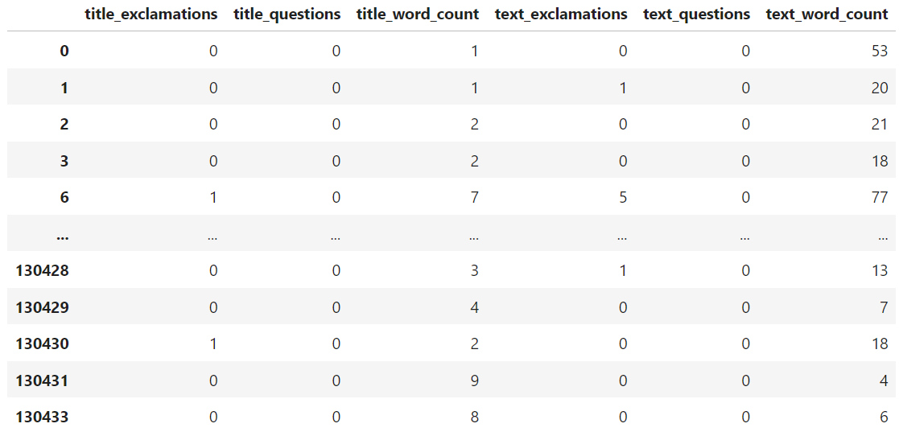

This is what the test feature data looks like after split and scale:
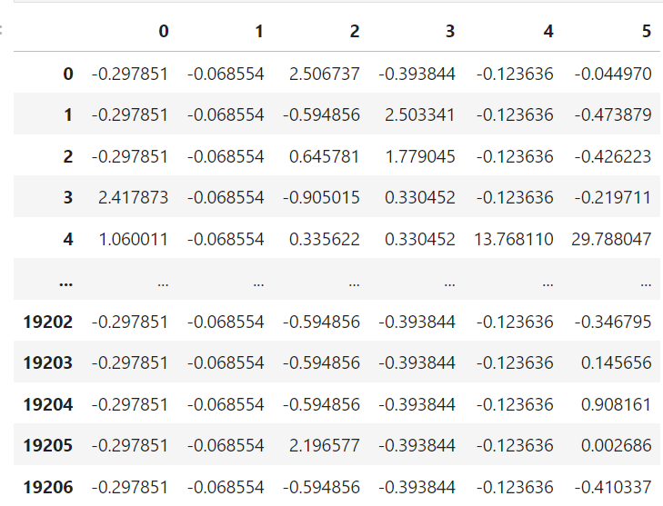

And the corresponding y_test:
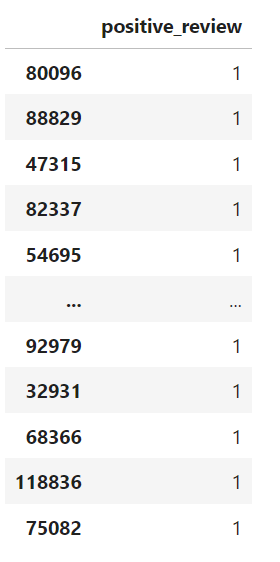

This is what the train feature data looks like after split and scale:
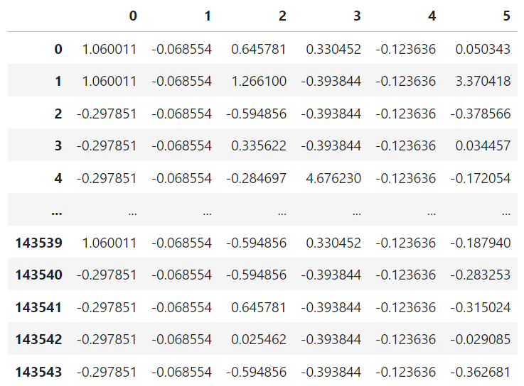

And the corresponding y_train:


Finally, here are the class distributions before and after oversampling:
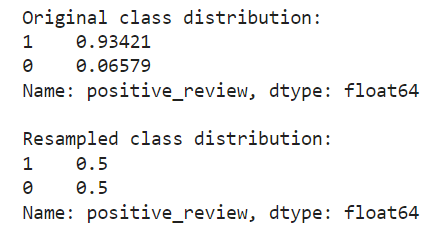

### Model 1
We see that for our first model, it seems to do very poorly on our imbalanaced dataset. We see that the training performance achieves a precision and recall of 0.09 and 0.46 respectively for non-positive reviews while achieving 0.95 and 0.69 respectively for positive reviews, with the testing performances doing roughly similar. Overall, as shown in the graph below, we achieved a log loss of approximately 0.68 for both training and testing (and accuracy of apparoximately 0.67 for both), which would suggest the model is not overfitting. But, a 0.16 F1-score for the negative class (while the positive class has 0.8 F1-score) is not a great metric to have for this model evaluation. We see that this logistic regression model does not do well and gives very imbalanced results and would need to improve.

Train Set Performance:
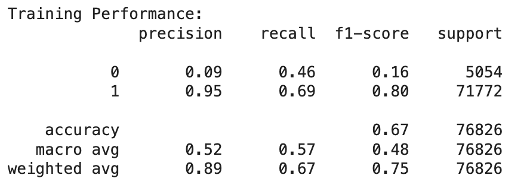

Test Set Performance:
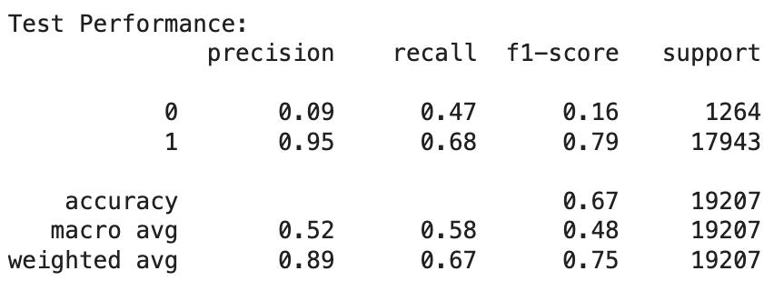

Training/Test Error v Complexity:
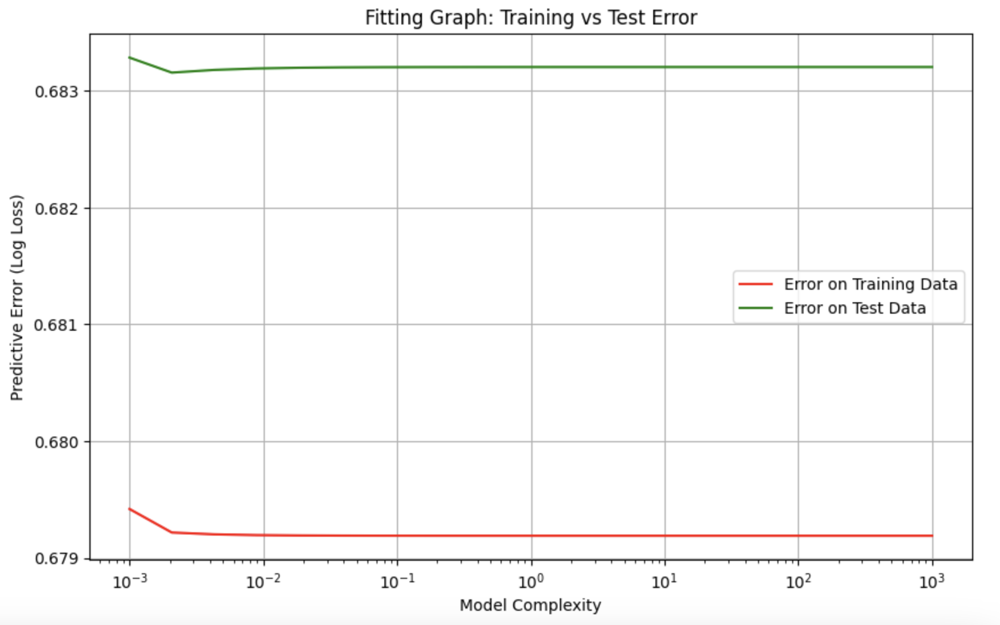

### Model 2
We see that there is quite some bit of improvement in the second model. From the training data, we see that our training performance achieves a precision and recall of 0.65 and 0.89 respectively for non-positive and positive reviews while achieving a 0.99 and 0.97 precision and recall respectively for positive ones, with the testing performances being somewhat lower yet still comparable in precision and recall (at 0.53 and 0.74 for non-positive reviews and 0.98 and 0.95 for positive ones). We see that the F1-score is much more improved as well for both training and testing, seeing a jump from 0.16 to 0.62 and 0.79 to 0.97 F1-scores for the testing data for non-positive data and positive data respectively. We also see a much more improved accuracy at 0.96 for training and 0.94 for testing. One thing we did notice is that with higher model compelxities, there does seem to be a very slight sign of overfitting as shown below: the difference between test loss and training loss increases with model complexity. However, overall, we see massive improvements to our model and a more balanced performance.

Train Set Performance:
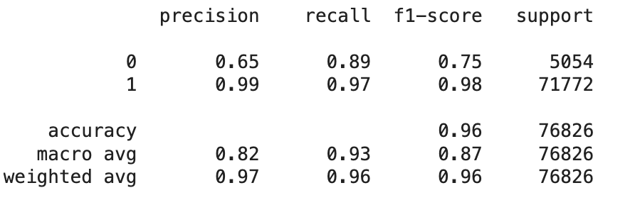

Test Set Performance:
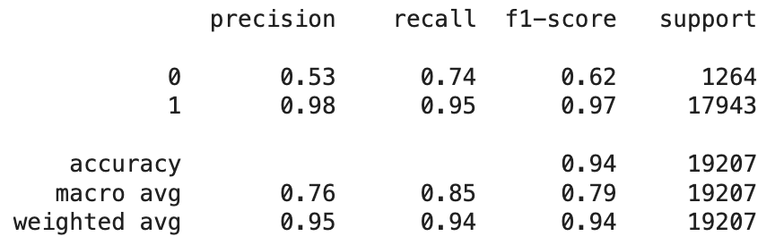

Training/Test Error v Complexity:
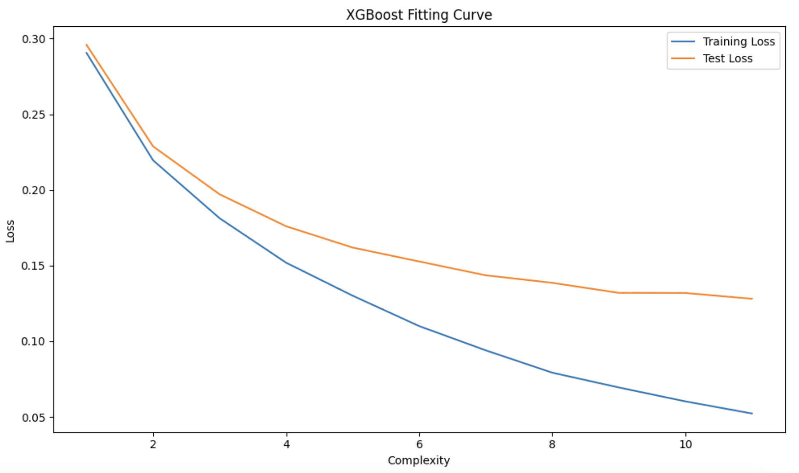

### Model 3
We see that for the third model, there are even further improvements in the training. We see that the precision for non-positive reviews goes up from 0.65 to 0.85 while maintaining a 0.99 precision for positive reviews with a F1-score at 0.87 and 0.99 respectively. Similarly, we see improvements on the recall as well as the training performance seeing an increase from 0.89 to 0.9 in recall for the non-positive class and an increase from 0.97 to 0.99 in the positive class. As for the testing results, we see that most values of precision and recall increase or at the very least stay the same across the positive and non-positve reviews, except for the recall on the non-positive class, but this is rather small 0.74 to 0.67. The overall accuracy of our model is higher as well. We have a 0.98 accuracy in training (up from 0.96 in Model 2) and 0.95 accuracy in testing (up from 0.94 in Model 2). Overall, Model 3 does the best in terms of F1-score and accuracy, and more!

Accuracy/Loss(binary cross-entropy) over each training epoch:
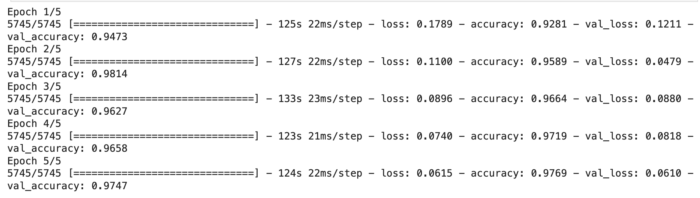

Train Set Performance:
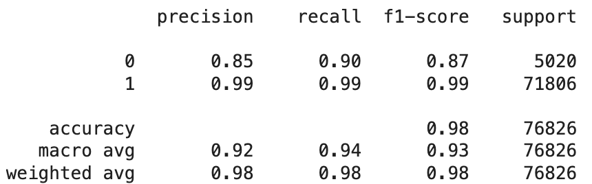

Test Set Performance:
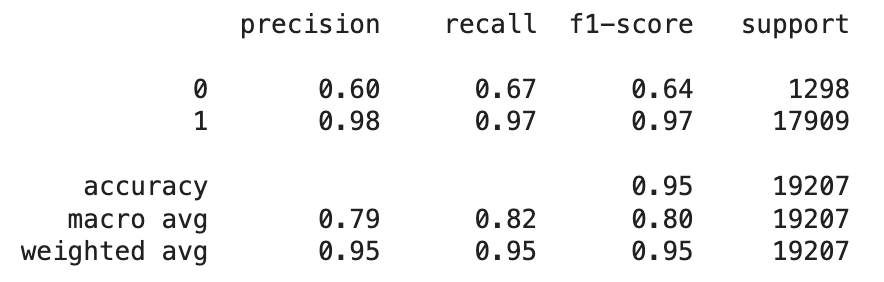

## Discussion

When it came to data exploration, our main goals were to gain an understanding of the data's distribution, as well as to see which features were most correlated with rating to best inform our next steps.

Initially, it became clear quickly that we had a severe class imbalance, as the mean review rating was around 4.5, and 5 star reviews made up over 75% of the total reviews. 
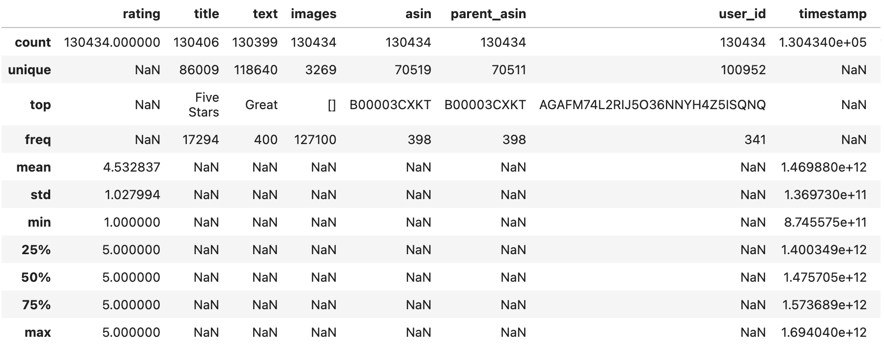

It was clear off of the start that the columns images, asin, parent_asin, user_id, and verified purchase are not correlated with rating, and should not be used in our model.

Images: this was, for the most case, just images of the product, which does not depend on review rating at all.

Parent_asin, asin, user_id: these are just identification numbers for the specific product/user, so should not be considered. 

For the other numerical features, like timestamp and helpful votes, it became clear after pairplotting that these did not correlate with rating.

### Data Preprocessing
The first key choice we made when doing data preprocessing was to only consider verified reviews for our train/test sets, which we chose as non-verified reviews are not credible and not representative of what someone says when they try a product, as they could've left the review without trying it.

Our next choice was how we decided to fill in missing title/text values. We chose to do this, as stated earliler, with the following scheme:
```
df['title'] = df.apply(lambda x: x['text'] if pd.isna(x['title']) and not pd.isna(x['text']) else x['title'], axis=1)
df['text'] = df.apply(lambda x: x['title'] if pd.isna(x['text']) and not pd.isna(x['title']) else x['text'], axis=1)

# if both title and text are missing fill based on rating
missing_mask = df['title'].isna() & df['text'].isna()
df.loc[missing_mask & (df['rating'].isin([4, 5])), ['title', 'text']] = 'very good'
df.loc[missing_mask & (df['rating'] == 3), ['title', 'text']] = 'good'
df.loc[missing_mask & (df['rating'].isin([1, 2])), ['title', 'text']] = 'bad'
```

The reason we chose to do this was because at this point, for our first model, we wanted to keep separate text and title columns, and needed values for both. Our closest estimation to a user's sentiment when it comes to title/text would be what they put for the other field. However, this choice may have affected our model performance later down the road, as eventually we didn't have separate columns for text and titles, and just vectorized/tokenized the combined text. This means that for the entries that only had title, or only had text, the final combined text just ended up being repeated twice.

In terms of the values we chose for title and text in the case that both were missing, we did this based off of our scale, which had ratings >=3 being a positive review, and scores < 3 being negative. Therefore, it made sense to put sample text corresponding to a negative review for ratings 1 and 2, and sample text corresponding to a positive review for ratings over 3. Also, we knew the choice wasn't very important, as from the Data Exploration, we knew that there were only 40 or so entries with null values for text or title, out of the 130,000 total examples. Thus, we didn't need to waste too much time or resources deciding on the best specific words, and just did something simple that reflected the sentiment for each rating.

Furthermore, we chose to remove HTML entities, emojis, and whitespace from the text to standardize the text, and to remove unnecessary complexity that only appeared in a few reviews, like emojis.

Our main choice for the data was how to represent the text in a way that a Logistic Regression model could reason on. Initially, we chose to see if question mark count, exclamation point count, and word count were enough information, and the data we received from this informed our choices for future models. Since it was our first model, it made sense to start with something simple that could inform our future experiments, and show us how important it is to include information about the specific words rather than just punctuation.

In addition, one of our key issues with our dataset, as seen in Data Exploration, was the class imbalance, with the dataset having way more positive than negative reviews. We decided to use an over sampling method, because this class imbalance had to be addressed for any reasonable model, otherwise a model that only ever predicted positive would have great accuracy. Without oversampling, it would be difficult to train a model that reasons well because it would just trend towards only predicting positive.

Also, given our class imbalance, we wanted to group together ratings of 1 and 2, as there were just not enough observations with a rating of 1 or observations with a rating of 2 to have them be their own classes. This is why we chose to have a positive review column instead of rating. 

For our oversampling method, we started with just RandomOverSampling, which just takes random negative observations and duplicates them to balance out the classes. For our first model, we wanted to start with something simple, and based on our results, then see if more advanced methods were necessary. 

### Model 1
The reason we chose to start with a Logistic Regression model was because we knew we had a classification task, and we wanted to understand how complex of a model we needed for our task, as well as how complex our data representation needs to be. 

However, upon evaluating our results, it becomes clear that the model results are not much better than simply always predicting a positive review, as our precision for the negative class was just 9%. 

Then, to evaluate how model complexity affected our results, we decided to try various values for the regularization parameter C, and map out how model complexity affected error. It was clear that model complexity did not cause overfitting, as the difference between error on the training and test data didn't grow with increased complexity. This indicated that we could safely try more complex models without overfitting.

Also, it became clear, due to our low overall accuracy, that we needed more complex representations of our data, with words in the text actually being accounted for. In addition, we needed a more advanced oversampling technique, as RandomOverSampling does not actually introduce new data, meaning it doesn't effectively address the class imbalance.

### Model 2
Our conclusions from our Model 1 experiment led us to try a more advanced oversampling technique, SMOTE, to adjust for the class imbalance.

SMOTE works by taking samples from the minority class, and for each sample, finding its nearest neighbors in the feature space. Then, it creates new, artificial samples in the feature space by creating several new examples with the average of the sample and each of its neighbors.

This will help our data representation be more diverse while also balancing the classes, and allows models to obtain better decision boundaries as it will create new examples within regions of the feature space that didn't have many examples before. 

Furthermore, we decided to diversify and complexify our data representation further by using a vectorizer, TfidfVectorizer, to vectorize the text data, meaning our data now represented the individual words and their meaning. We decided to set max_features to 5000, meaning only the 5000 most important tokens in the text were used, to reduce overall computational complexity and to prevent overfitting. In addition, we set ngram_range to (1,2), meaning the vectorizer will extract single word sequences as well as 2 word sequences. We didn't have it extract longer word sequences to again avoid overfitting, although it may have been good to try experiments with longer word sequences, to see if it improved test performance.

For the model itself, we wanted to use something more complex than LogisticRegression, given that now we had 5000 features, each representing different tokens, meaning we introduced a lot of copmlexity. We decided on using a gradient boosted tree from XGBoost as our classifier. A gradient boosted tree is basically a classifier made up of many different decision trees, that considers the output of each tree on each class, and sums them. This allows for a model that can capture more complex relationships than just one decision tree.

We again chose to try varying complexities for the XGBoost model, to see train/test error for different complexities. It becomes clear that with more complexity, our model performed better, as it achieved lower error on the test set. However, it did seem to show some signs of overfitting, as the gap between train/test error began to widen. This informed us that maybe we need a model with better generalization abilities, as we were fitting the training set very well, but not as well on the test set. This might have been achieved with more regularization or better vectorization of the input text. 

Overall, we did achieve fairly good results with this model, getting 94% accuracy on the test set vs 67% on the test set with model 1. From this experiment, it became clear there was a lot of benefit from increasing the complexity of our data representation as well as increasing our model complexity.

### Model 3
For our third model, we decided to try a neural network. Now, we could tokenize the entire text response for this example, and have our model learn based off of these tokens, so the vectorized representation of the text tokens would be learned based off of our data, and not use a predetermined algorithm like in the case of the Tfidf-vectorizer.

Thus, we used the TextVectorizer from keras to turn the text into tokens, and had our input layer for our model be an embedding layer that would embed these tokens into a feature space, which could capture complex things like word meaning and relationships between words. For our hidden model layers, we just used convolutional and pooling layers. 

We chose convolutional layers because we wanted words to be considered next to their neighbors, as the meaning of words is often derived from their context. Thus, by using convolutions with a filter size of 7, we are capturing the meaning of several different tokens at once, allowing our model to account for the relationships between words. 

We had 4 hidden layers in our model, to ensure our model was able to capture complexity while also to avoid using too many layers, to prevent the overfitting we saw in model 2. For our output layer, we chose to use a Dense layer, to take the high-level features extracted from the previous convolutions and ensure all of them were considered for the final prediction.

We then trained for 5 epochs, and using a small validation split when training to measure the performance over each epoch. The validation performance went up as training continued, which is good as it means our model was learning to generalize. Furthermore, our final precision and recall for the negative reviews, which was our main issue with models 1 and 2, seemed to improve both for our train and test set, meaning a neural network was a step in the right direction. 

The key change that really enabled this model to perform better was the use of an embedding layer, which really allowed the model to capture the true meaning of the text for each review.

## Conclusion
In our journey using the Amazon Digital Music reviews, as a team we discovered just how diverse the machine learning ecosystem truly is for trying to do prediction tasks. Our first attempt with a simple Logistic Regression model was pretty much a bust - it could barely distinguish between positive and negative reviews, scoring dismally low on identifying negative reviews. 

However, our next two models were where all the exciting work happened. By introducing more sophisticated techniques like SMOTE for balancing our dataset, using TF-IDF to better understand the text, and eventually employing a neural network with multiple layer, we saw each model's performance gradually become better. We went from a model that was basically guessing, to one that could accurately predict review sentiments with around 95% accuracy. The real game-changer was the neural network, which could somehow capture the nuanced meaning behind words in a way our earlier models couldn't. 

One thing we could've done a little differently is better feature selection for our first logistic regression model. We kind of settled on somewhat simple features to see if that would lead anywhere, but maybe we could've used techniques to tease out better features. Also, if we had more time, we would've probably explored further with more advanced deep learning models. Maybe even training some very popular NLP models like BERT on this data to see how much better it can do. 

Overall though, we all learned a lot from this project and look forward to continuing our journey in machine learning!

## Statement of Collaboration
- Anthony Pertsel: Coder/Writer: Coded Model 1, wrote Discussion + Methods on writeup, discussed and proofread all the other parts with group members.
- Saeji: Coder/Writer: did the data preprocessing and exploration, wrote Results and added Figures on writeup, discussed and proofread all the other parts with group members.
- Edward: Coder/Writer: did Models 2 and 3, wrote Intro and Conclusion, discussed and proofread all the other parts with group members.
