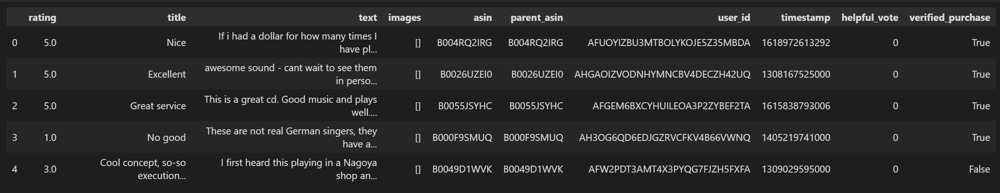
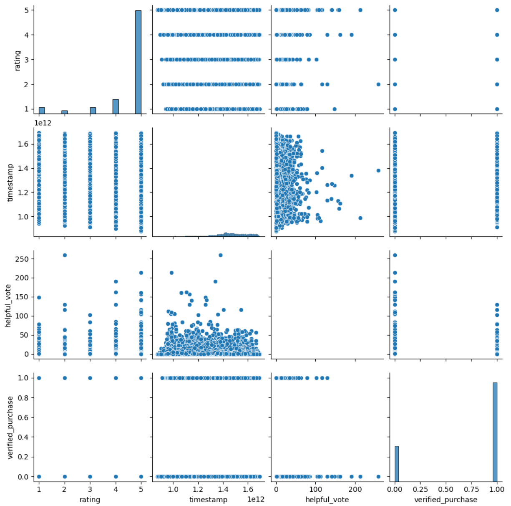

# 151A Project

## Introduction
We decided to pursue this project for its real-world relevance in addressing the challenge of predicting user ratings from textual reviews. For this project, we decided to focus on the [Amazon Digital_Music](https://amazon-reviews-2023.github.io/) reviews dataset. This topic touches on the intersection of sentiment analysis, focusing on how user-generated content can reveal customer satisfaction. The dataset's inherent challenges, such as class imbalance, make it an interesting and valuable task for machine learning practitioners, while its application in the digital music domain aligns with practical and impactful use cases like personalized recommendations.

We thought this project to be exciting because it shows the power of machine learning techniques to interpret natural language and deliver meaningful insights. A good predictive model in this context can have the following implications: it can enhance customer satisfaction, improve platform loyalty, and support better business strategies by understanding user needs. It also enables user to discover music they love more efficiently. 

## Methods

### Data Exploration
All data exploration can be found here: [Exploration Notebook](https://github.com/EddieJ03/151a-project/blob/Milestone2/DataCleaning.ipynb)

To start exploring the data, we first converted it from a JSON file into a CSV format. After converting, we took a look at the first couple of rows to get a sense of the data:


We then decided to see what columns and rows had missing values, and how much. This led us to discover the following:
```
rating                0
title                20
text                 23
images                0
asin                  0
parent_asin           0
user_id               0
timestamp             0
helpful_vote          0
verified_purchase     0
```
So it looks like the data is fairly complete, with only some missing data for the title and text columns.

We were then curious about the number of unique values per each column, which led us to find the following:
```
Column 'rating' has 5 unique values.
Column 'title' has 86010 unique values.
Column 'text' has 118641 unique values.
Column 'images' has 3269 unique values.
Column 'asin' has 70519 unique values.
Column 'parent_asin' has 70511 unique values.
Column 'user_id' has 100952 unique values.
Column 'timestamp' has 128745 unique values.
Column 'helpful_vote' has 96 unique values.
Column 'verified_purchase' has 2 unique values.
```

As expected, columns dealing with more variable data such as text and time have the most diversity, whereas the numerical columns have much less unique values.

We noticed the verified_purchase column only had two values, likely for verify and not verified. We were curious how much reviews were verified, and we got the following:
```
True     96033
False    34401
``` 

Finally, we did a pairplot between all the numerical columns to notice any relationships, and got the following:


Since we are mostly interested in predicing the `rating` column, we decided to take a look at how the other columns might affect it. One thing to notice is that there doesn't seem to be a clear trend between timestamp and rating, suggesting ratings are not strongly correlated with the time of review. Another observation is that a lot of the ratings are 5, if you'll notice the top-left plot. Additionally, the helpful vote values look to be somewhat normally sitributed around the ratings. Another way of looking at it is every rating has at least one helpful vote. This also applies for verified purchase.

### Data Preprocessing
All data preprocessing can be found here: [Preprocessing Notebook](https://github.com/EddieJ03/151a-project/blob/Milestone3/DataCleaning.ipynb)

Our data preprocessing included several steps. First of all, we chose to use only verified reviews, i.e., only reviews from those who actually purrchased the music. Then, we filtered the data columns to only include the title, text, and review columns, getting rid of columns like userid, images, helpful votes, etc.

Next, we had to account for the observations that had a title, but were missing text, and vice versa. In these cases, we just filled in the text with the title if the text was empty, or the title with the text if the title was empty. If both the title and text were missing, we just accounted for this by making some dummy text corresponding to the rating:
```
    df.loc[missing_mask & (df['rating'].isin([4, 5])), ['title', 'text']] = 'very good'
    df.loc[missing_mask & (df['rating'] == 3), ['title', 'text']] = 'good'
    df.loc[missing_mask & (df['rating'].isin([1, 2])), ['title', 'text']] = 'bad'
```

We also cleaned all the text appearing in the 'title' or 'text' columns to remove whitespace, emojis, or html entities that were left over. 

Then, we created columns based off the text and titles, 3 for the title and 3 for the text. The columns we created are 'title_exclamations' (# of exclamation marks), 'title_questions' (# of question marks), 'title_word_count', and the same 3 for the text. 

Next, we made a positive review column, where a rating of 3 or more was considered positive, and a rating lower than 3 was considered negative.

We then trimmed our dataframe to include only the 3 title columns, 3 text columns, and the positive review column, with our X being the title/text columns, and our Y being the positive review column.

Next, we scaled our data, using StandardScaler from sklearn. 

Finally, due to our class imbalance, with many more positive reviews than negative ones, we used a RandomOverSampler, to balance out the classes. 

### Model 1
Our first model can be found in this notebook as well: [Preprocessing Notebook](https://github.com/EddieJ03/151a-project/blob/Milestone3/DataCleaning.ipynb)

For this model, we decided to use a LogisticRegression model, and tried with various regularization values to see if the model improved with more/less complexity. 
```
complexity_values = np.logspace(-3, 3, 20)  # from simple to very complex
train_errors = []
test_errors = []

for C in complexity_values:
    model = LogisticRegression(random_state=42, max_iter=1000, C=C)
    model.fit(X_train_balanced, y_train_balanced)
```
As can be seen in the code snippet above, we decided to tune the model's regularization to see how this affected performance. This not only informed us on the best parameters for logistic regression, but also gave us insight on what to tune for model 2. 


### Model 2
All our second model code can be found here: [All Steps Notebook](https://github.com/EddieJ03/151a-project/blob/Milestone4/DataCleaning.ipynb)

For our second model, we decided to use a TfidfVectorizer to vectorize the text in the reviews, rather than using # of question marks, word count, and # of exclamation marks. For our parameters for this vectorizer, we decided to cap the number of features at 5000, and allowed it to consider single and two-word sequences by setting ngram_range to (1,2). Also note that we combined the text and title together for each review, then vectorized.
```
tfidf = TfidfVectorizer(max_features=5000, ngram_range=(1, 2))
```

We also decided to address our class imbalance using SMOTE rather than RandomOverSampler, as used for Model 1. 
```
smote = SMOTE(random_state=42)
X_train_balanced, y_train_balanced = smote.fit_resample(X_train, y_train)
```

For the model itself, we chose to use a gradient boosted tree, with the library XGBoost. In terms of the model parameters, we chose to have it use the softmax function to make class probabilities, and made the evaluation metric be log loss. 
```
xgb = XGBClassifier(
    objective='multi:softmax',
    num_class=len(set(y)), 
    eval_metric='mlogloss',
    use_label_encoder=False
)
```
To test various model complexities, we varied the max tree depth and made several different models, with depths from 1 to 12, to ensure we weren't overfitting. 
 
### Model 3
For this model, we chose a new vectorizer, keras.layers.TextVectorization, along with a neural network for classification. 
```
vectorizer = keras.layers.TextVectorization(max_tokens=max_tokens, output_mode='int', output_sequence_length=max_length)
```

For classification, we decided on a 4 hidden layer network, with convolutions and maxpools making up the hidden layers. For the input, we had an embedding layer that converted tokens into a vectorized embedding. For the output, we just had a dense layer that used a sigmoid activation layer to predict class outputs. As an optimizer for training, we chose AdamW. 
```
model = keras.Sequential() 

model.add(keras.layers.Embedding(max_tokens, 32, input_length=max_length)) 

model.add(keras.layers.Conv1D(32, 7, activation='relu'))

model.add(keras.layers.MaxPooling1D(5))

model.add(keras.layers.Conv1D(32, 7, activation='relu'))

model.add(keras.layers.GlobalMaxPooling1D())

model.add(keras.layers.Dense(1, activation='sigmoid'))

model.compile(loss='binary_crossentropy', optimizer=keras.optimizers.AdamW(), metrics=['accuracy']) 
```

We chose to train this model for 5 epochs, with a batch size of 20. 

## Results

## Discussion

## Conclusion

# Statement of Collaboration

